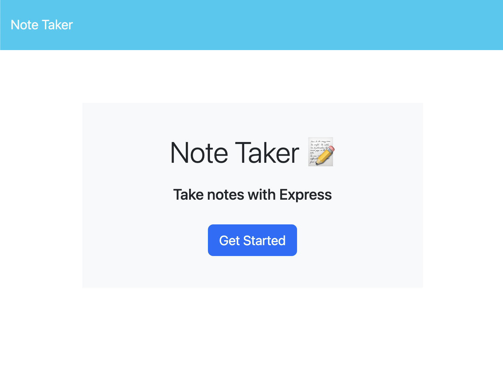
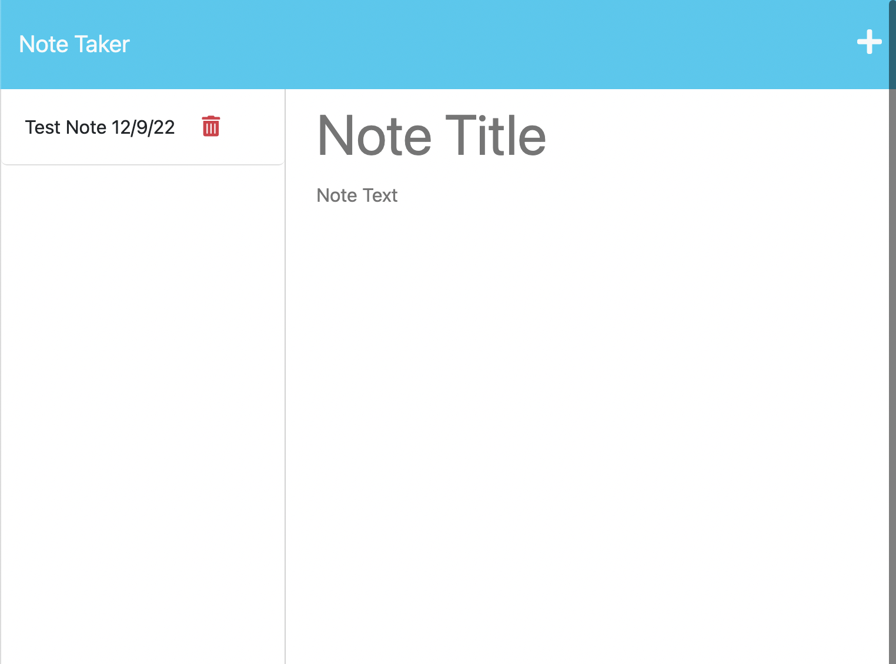

# Note Taker
### A web-based note taking app

This repository is for a simple note taking app. Using express.js and and a json database, it allows the user to enter, save, view, and delete notes that are stored server-sided.

A demo website is live [and can be viewed here.](https://note-taking-app-leu6.onrender.com/)

If all is well, the page should display like in these screenshots:

There is no license for this project and it is intended for educational purposes only.
